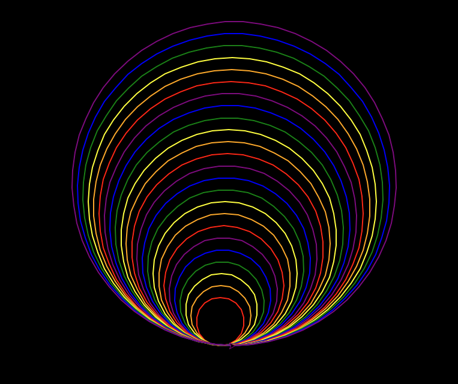

Kaleido-Spirale
===============

In diesem Projekt schichte du mit dem Modul ``turtle`` und einer klugen Schleifenmethode Kreise spiralig übereinander. Immer, wenn ein Kreis gezeichnet wird, erhöht das Programm die Parameter des Codes, der die Kreise zeichnet. Jeder Kreis ist anders als der vorhergehende, sodass das Muster interessanter wird.

.. code-block:: python

   import turtle as t
   from itertools import cycle

   colors = cycle(['red', 'orange', 'yellow', 'green', 'blue', 'purple'])

   def draw_circle(size, angle, shift):
       t.pencolor(next(colors))
       t.circle(size)
       t.right(angle)
       t.forward(shift)

       draw_circle(size + 10, angle + 10, shift + 1)

   t.bgcolor('black')
   t.speed('fast')
   t.pensize(2)

   draw_circle(40, 0, 1)

Meine Bilder
------------

.. image:: images/kaleido.png
   :width: 51%

.. image:: images/kaleido2.png
   :width: 46%

.. image:: images/test2.png
   :width: 52%

