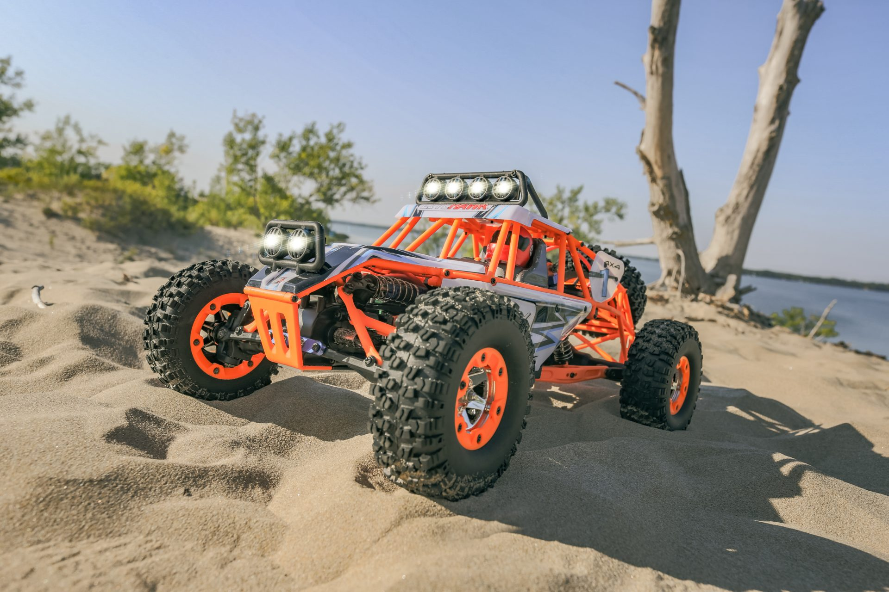
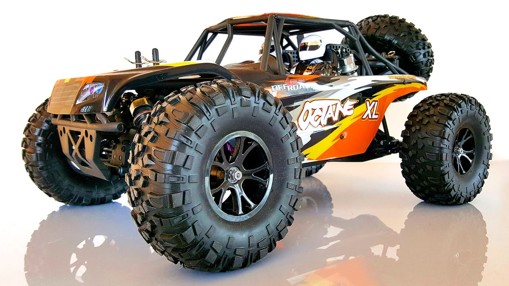
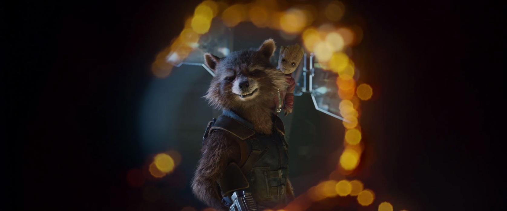

Interessen
==========

Modell-Autos
------------

|car| Schaue dir  hier_ den Racing Truck in Action an!

.. _hier: https://youtu.be/FJycnCM4LgQ

.. |car| replace:: 🚙💨

Marvel Heroes
-------------

.. image:: images/marvel.png
   :width: 250 px

Marvel Comics ist ein US-amerikanischer Comicverlag mit Sitz in New York City. Ich finde die Marvel Superhelden cool!

Meine Lieblingsfiguren
^^^^^^^^^^^^^^^^^^^^^^

Deadpool
""""""""

Innerhalb der Welt von Marvel Comics existiert keine definitve Biografie von Deadpool. In den Comics wird dies damit erklärt, dass Deadpool an Amnesie leidet und nur begrenzt zurechnungsfähig ist. Zudem kann er die vierte Wand durchbrechen und potentiell selbst seine Biografie ändern.

.. image:: images/deadpool.jpg

Guardians of the Galaxy
"""""""""""""""""""""""

Die Guardians of the Galaxy sind ein bunt zusammengewürfelter Haufen, dessen Anführer Star-Lord ein Relikt in die Finger bekommt, dass die Fähigkeit hat, ganze Galaxien zu zerstören. Ronan, einer von Thanos Admirälen, jagt die Guardians von Planet zu Planet um sie zu vernichten und den Orb, der unbeschreibliche Macht verspricht, für sich zu bekommen.

Bild-Quellen
************

 * https://provincetown.sterenelectronics.com/product/litehawk-max-rock-racer-4wd-r-c-car/
 * https://www.ebay.com/p/VRX-Racing-1-10-Scale-Octane-Brushless-Desert-Truggy-RC-Car-4wd-Truck-RTR-Rh1045/4020073350
 * http://cafenews.info/14/6462796-deadpool-2.html
 * https://amecomi.online/movie/marvel-guardian-of-the-galaxy-vol2-preview